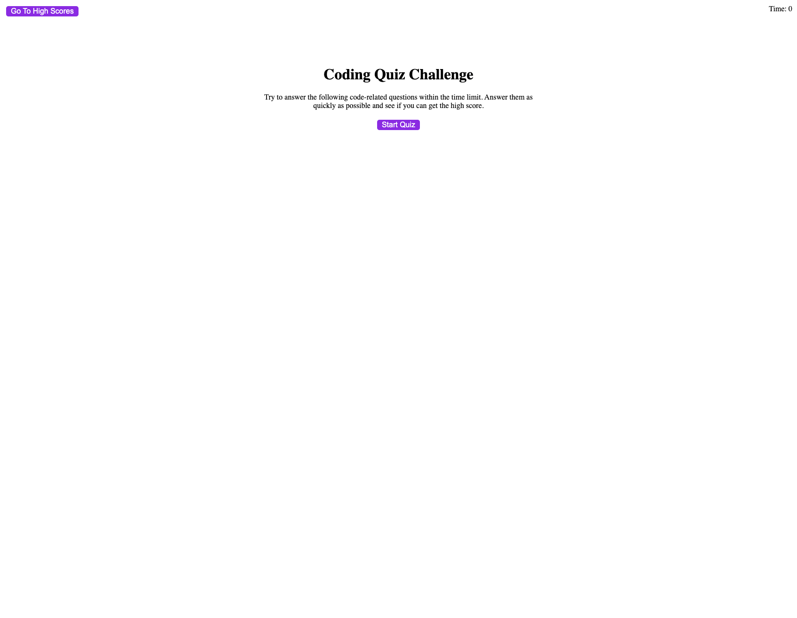
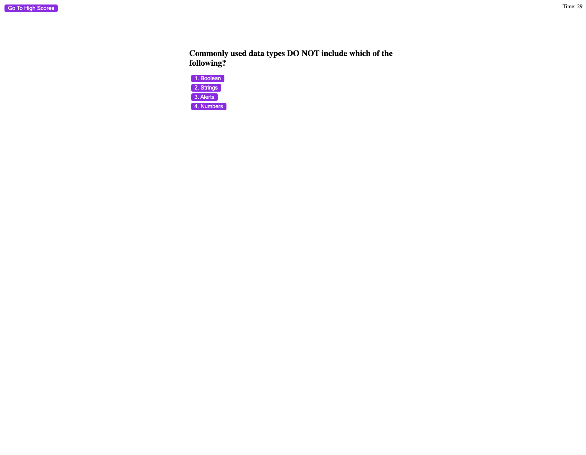
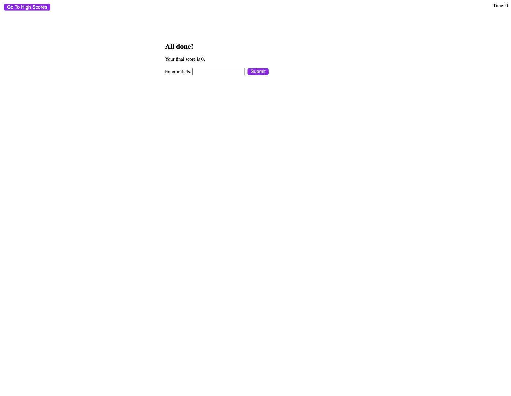

# Api Code Quiz 

## Description 

This code quiz is designed to help the user with their knowledge on coding. You get better and better as time goes on. 

## Problems
The problem for me for this activity was getting the pages to move between questions. In the beginning this was very hard. 

## Deployed Project 
[Api Code Quiz Live Site](https://emilyepozzi.github.io/api-code-quiz/)

### Screenshots

#### Contributors
Emily Pozzi
With massive help from my tutor, Joseph. 